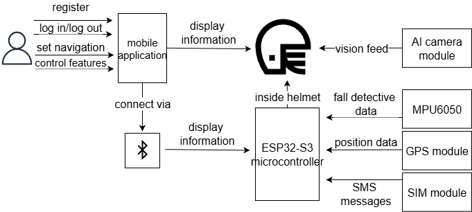
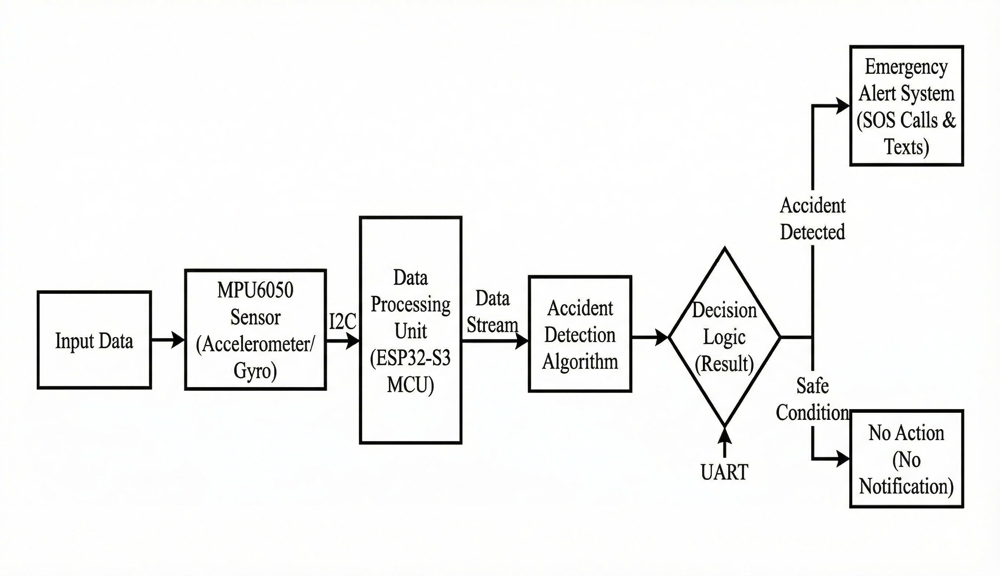
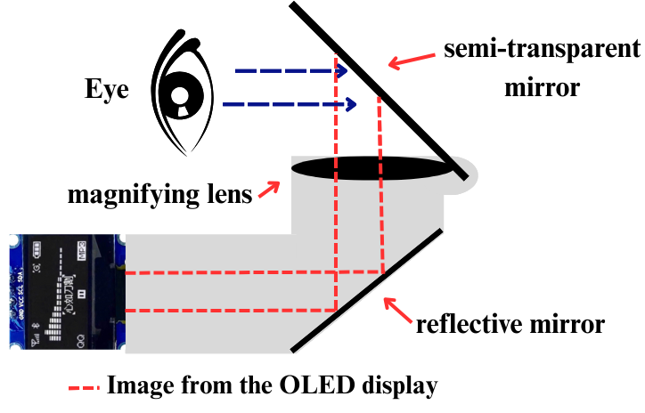

# Smart Helmet — ESP32-S3

An edge-based smart motorcycle helmet with **multi-evidence fall detection**, **BLE heads-up display (HUD) navigation**, and **automatic SOS alerts** — powered by an ESP32-S3 with FreeRTOS.



## Features

| Feature | Description |
|---|---|
| 🚨 Multi-evidence fall detection | MPU6050 IMU @ 100 Hz, Kalman + complementary filtering, 3-stage state machine (impact/tilt → 3 s recovery window → 10 s countdown) |
| 📱 SOS alert | If the rider does not cancel the alert within 10 s, an SMS with a Google Maps location link is sent to pre-registered contacts via the SIM A7680C (4G) + ATGM336H GPS |
| 🧭 HUD navigation | 0.96" OLED (SSD1306) shows turn-by-turn directions from a React Native app over BLE — street name, distance, direction icon, instruction |
| 👁️ Vision-based drowsiness detection | YOLOv5n running on a Sipeed MaixCAM (edge AI), custom 15,000-image oblique-angle dataset, duration-based temporal filtering |
| 🔋 Low power | 7–9 h battery life on a 2000 mAh Li-Po, < $85 total system cost |

## Hardware

| Component | Role |
|---|---|
| ESP32-S3 (ESP32-S3-DevKitC-1) | Main MCU — IMU sampling, BLE, HUD, FreeRTOS |
| MPU6050 | 6-axis IMU for fall detection (I2C) |
| SIM A7680C | 4G GSM module for SOS SMS (UART2) |
| ATGM336H | GPS module, NMEA over UART1 |
| 0.96" OLED SSD1306 | HUD display (I2C) |
| Sipeed MaixCAM | Vision inference — drowsiness detection (not in this repo) |

## How it works

### Fall detection (3-stage pipeline)

1. **Stage 1 — Impact/tilt trigger**: resultant acceleration > ~2.5 g (threshold tunable via speed/road/factor constants) **or** helmet tilt > 60° from vertical.
2. **Stage 2 — Recovery window (3 s)**: if tilt returns below 30° and acceleration settles back to 0.8–1.2 g, the event is discarded as a false positive (sharp braking, curb impact).
3. **Stage 3 — Alert (10 s countdown)**: LED blinks and the countdown is printed. The rider cancels by holding the cancel button (pin 4). On timeout, the SOS task is resumed: GPS fix → SMS with `https://maps.google.com/?q=<lat>,<lon>` → suspend until next crash.



### HUD + BLE navigation

The helmet advertises BLE service `DD3F0AD1-6239-4E1F-81F1-91F6C9F01D86`. The companion React Native app writes a JSON payload (`nav`, `inst`, `dist`, `street`, `nstreet`, `dir`, `step`, `total`) to the write characteristic; the ESP32 parses it and renders it on the OLED. Vietnamese diacritics are stripped for the SSD1306's basic font.



## Wiring

| ESP32-S3 pin | Peripheral |
|---|---|
| 33 (SDA) / 32 (SCL) | MPU6050 + OLED (I2C) |
| 18 (RX) / 17 (TX) | ATGM336H GPS (UART1, 9600) |
| 26 (RX) / 27 (TX) | SIM A7680C (UART2, 115200) |
| 2 | Alert LED |
| 4 | Cancel button (INPUT_PULLUP, LOW = pressed) |

> Configure the SOS recipient in `firmware/src/SmsGps.h` → `SOS_PHONE`.

## Getting started

```bash
# 1. Install PlatformIO (https://platformio.org)
pip install platformio

# 2. Build
pio run -d firmware

# 3. Flash
pio run -d firmware -t upload

# 4. Serial monitor
pio device monitor -d firmware
```

Requires PlatformIO with the `espressif32` platform; libraries (MPU6050, ArduinoJson, Adafruit GFX/SSD1306) are resolved automatically from `platformio.ini`.

## Repo structure

```
firmware/
├── platformio.ini       # build config + library dependencies
└── src/
    ├── main.ino         # FreeRTOS: Sensor (100 Hz) / HUD / SMS tasks
    ├── VapCo.h/.cpp     # SmartHelmetSensor — fall detection state machine
    ├── HUD.h/.cpp       # OLED display + BLE server + JSON navigation parser
    └── SmsGps.h/.cpp    # GPS NMEA parsing + SIM A7680C AT commands
docs/                    # architecture and prototype images
```

## Results (pilot urban trials, Ho Chi Minh City)

- 35% reduction in eyes-off-road time (ISO 15007 A/B vs. handlebar phone)
- 8% false-positive rate in fall detection
- 78% eye-state accuracy at 30 FPS on MaixCAM (YOLOv5n, custom dataset)
- 12 s end-to-end time-to-notify; 95% SMS delivery at 2-bar coverage
- 7–9 h battery life; < $85 system cost

## License

MIT — see [LICENSE](LICENSE).
